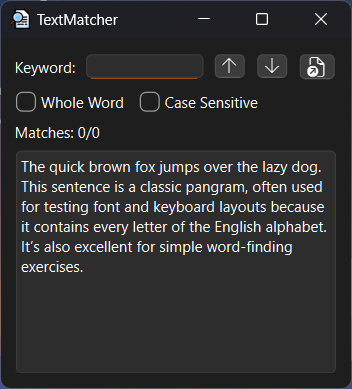

# TextMatcher 🔍

<div align="center">



**A powerful text search and navigation tool built with Qt6 and modern C++**

[](https://isocpp.org/)
[](https://www.qt.io/)
[](https://cmake.org/)
[](LICENSE)
[](https://doc.qt.io/qt-6/supported-platforms.html)
[](CONTRIBUTING.md)

[Features](#-features) • [Installation](#-installation) • [Usage](#-usage) • [Contributing](#-contributing)

</div>

---

## 🎯 Overview

TextMatcher is a cross-platform desktop application for efficient text search and navigation. Built with Qt6 and C++17, it provides regex-powered search with real-time visual feedback and intuitive keyboard-driven navigation.

**Key Highlights:**
- **⚡ Fast Search** - Regex-based pattern matching with instant results
- **🎨 Visual Excellence** - Smart dual-color highlighting system that distinguishes current match from all matches
- **🧠 Intelligent Search** - Whole-word matching, case sensitivity control, and automatic wraparound
- **⌨️ Keyboard Control** - Complete keyboard-driven workflow with intuitive shortcuts
- **🎯 Precision Navigation** - Real-time match counter shows your exact position (e.g., "3 of 47 matches")
- **🔄 State Aware** - Smart caching avoids redundant searches when navigating same results
- **🌍 Cross-Platform** - Native look and feel on Windows, Linux, and macOS

## ✨ Features

### 🔍 Search Capabilities
- **Pattern Matching** - Full QRegularExpression (PCRE2) support
- **Whole Word Search** - Match complete words only using word boundaries
- **Case Sensitivity** - Toggle case-sensitive/insensitive matching
- **Bidirectional** - Navigate forward and backward through results
- **Wraparound** - Seamlessly cycle through matches at document boundaries

### 🎨 User Interface
- **Multi-Match Highlighting** - All matches highlighted simultaneously
- **Current Match Emphasis** - Distinct color for active result
- **Match Counter** - Shows position like "Matches: 3/47"
- **File Loading** - Native file dialogs with directory memory
- **Keyboard Shortcuts** - Arrow keys, Enter, Ctrl+O, Ctrl+L

### ⚡ Performance
- **Optimized Counting** - Early exit algorithm for current position
- **State Caching** - Avoids re-counting when navigating same search
- **Efficient Rendering** - QTextEdit extraSelections for highlighting
- **Responsive** - Handles 1000+ matches smoothly

## 📸 Screenshots

<details open>
<summary><b>Click to view screenshots</b></summary>

<table>
  <tr>
    <td align="center" width="50%">
      
      <br><b>🎯 Multi-Match Highlighting</b>
      <br><i>All matches highlighted, current match emphasized</i>
    </td>
    <td align="center" width="50%">
      
      <br><b>📝 Whole Word Search</b>
      <br><i>Find "run" without matching "running"</i>
    </td>
  </tr>
  <tr>
    <td align="center" width="50%">
      
      <br><b>🔤 Case Sensitive Mode</b>
      <br><i>Distinguish "Apple" from "apple"</i>
    </td>
    <td align="center" width="50%">
      
      <br><b>📁 File Loading</b>
      <br><i>Quick import with native file dialog</i>
    </td>
  </tr>
</table>

</details>

## 🚀 Installation

### Prerequisites

Ensure you have the following installed:

| Requirement      | Minimum Version | Recommended | Download |
|------------------|-----------------|-------------|----------|
| **C++ Compiler** | C++17           | C++20       | [GCC](https://gcc.gnu.org/) / [Clang](https://clang.llvm.org/) / [MSVC](https://visualstudio.microsoft.com/) |
| **Qt Framework** | 6.0             | 6.5+        | [Qt Downloads](https://www.qt.io/download) |
| **CMake**        | 3.16            | 3.25+       | [CMake](https://cmake.org/download/) |
| **Git**          | Any             | Latest      | [Git](https://git-scm.com/) |

**Optional but Recommended:**
- [Qt Creator](https://www.qt.io/product/development-tools) - Integrated development environment

### Quick Start (5 Minutes)

```bash
# 1. Clone the repository
git clone https://github.com/orkhan-muradov-dev/qt-text-matcher.git
cd qt-text-matcher

# 2. Create build directory
mkdir build && cd build

# 3. Configure (replace /path/to/Qt with your Qt installation)
cmake .. -DCMAKE_PREFIX_PATH=/path/to/Qt/6.x.x/gcc_64 -DCMAKE_BUILD_TYPE=Release

# 4. Build
cmake --build . --parallel

# 5. Run!
./TextMatcher
```

### Detailed Build Instructions

<details>
<summary><b>🪟 Windows (Click to expand)</b></summary>

#### Using MinGW

```powershell
# Open PowerShell or Command Prompt
git clone https://github.com/orkhan-muradov-dev/qt-text-matcher.git
cd qt-text-matcher
mkdir build
cd build

# Configure with MinGW
cmake .. -G "MinGW Makefiles" ^
  -DCMAKE_PREFIX_PATH=C:/Qt/6.5.0/mingw_64 ^
  -DCMAKE_BUILD_TYPE=Release

# Build
cmake --build . --config Release --parallel

# Run
Release\TextMatcher.exe
```

#### Using Visual Studio

```powershell
# Configure with Visual Studio 2022
cmake .. -G "Visual Studio 17 2022" ^
  -DCMAKE_PREFIX_PATH=C:/Qt/6.5.0/msvc2019_64 ^
  -DCMAKE_BUILD_TYPE=Release

# Build
cmake --build . --config Release

# Run
Release\TextMatcher.exe
```

</details>

<details>
<summary><b>🐧 Linux (Click to expand)</b></summary>

```bash
# Install dependencies (Ubuntu/Debian)
sudo apt update
sudo apt install build-essential cmake qt6-base-dev

# Or on Fedora
sudo dnf install gcc-c++ cmake qt6-qtbase-devel

# Clone and build
git clone https://github.com/orkhan-muradov-dev/qt-text-matcher.git
cd qt-text-matcher
mkdir build && cd build

# Configure
cmake .. -DCMAKE_BUILD_TYPE=Release

# Build with all cores
cmake --build . --parallel $(nproc)

# Run
./TextMatcher
```

**Adding to Applications Menu:**
```bash
# Create desktop entry
cat > ~/.local/share/applications/textmatcher.desktop << EOF
[Desktop Entry]
Name=TextMatcher
Exec=/path/to/TextMatcher/build/TextMatcher
Icon=/path/to/TextMatcher/media/app-overview.png
Type=Application
Categories=Utility;TextEditor;
EOF
```

</details>

<details>
<summary><b>🍎 macOS (Click to expand)</b></summary>

```bash
# Install dependencies via Homebrew
brew install cmake qt@6

# Clone and build
git clone https://github.com/orkhan-muradov-dev/qt-text-matcher.git
cd qt-text-matcher
mkdir build && cd build

# Configure (may need to specify Qt path)
export Qt6_DIR=/usr/local/opt/qt@6/lib/cmake/Qt6
cmake .. -DCMAKE_BUILD_TYPE=Release

# Build
cmake --build . --parallel

# Run
./TextMatcher.app/Contents/MacOS/TextMatcher
```

**Creating .app Bundle:**
```bash
# Use macdeployqt to create standalone application
/path/to/Qt/6.x.x/macos/bin/macdeployqt TextMatcher.app -dmg
```

</details>

<details>
<summary><b>🎨 Qt Creator (Recommended for Development)</b></summary>

1. **Open Project**
   - Launch Qt Creator
   - `File → Open File or Project...`
   - Select `CMakeLists.txt` from the cloned repository

2. **Configure Kit**
   - Choose your Qt6 kit (Desktop Qt 6.x.x)
   - Click "Configure Project"

3. **Build & Run**
   - Press `Ctrl+B` (Cmd+B on macOS) to build
   - Press `Ctrl+R` (Cmd+R on macOS) to run

4. **Debug**
   - Set breakpoints by clicking line numbers
   - Press `F5` to start debugging

</details>

### Build Options

Customize your build with CMake options:

```bash
# Debug build with symbols
cmake .. -DCMAKE_BUILD_TYPE=Debug

# Release with debug info
cmake .. -DCMAKE_BUILD_TYPE=RelWithDebInfo

# Static linking (where applicable)
cmake .. -DBUILD_SHARED_LIBS=OFF

# Custom install prefix
cmake .. -DCMAKE_INSTALL_PREFIX=/opt/textmatcher

# Specify compiler
cmake .. -DCMAKE_CXX_COMPILER=g++-12
```

### Verifying Installation

```bash
# Check the built executable
./TextMatcher --version  # (if version flag implemented)

# Or simply run it
./TextMatcher

# Expected: Application window opens with sample text loaded
```

## 📖 Usage

### Basic Workflow

1. **Start Searching**
   - Type your search term in the "Keyword" field
   - Press `Enter` or click `↓` button to find first match
   - Current match highlighted in orange, others in yellow

2. **Navigate Results**
   - Press `↓` or `Enter` for next match
   - Press `↑` for previous match
   - Watch the counter update (e.g., "Matches: 5/23")

3. **Refine Search**
   - Check **Whole Word** to match complete words only
   - Check **Case Sensitive** for exact case matching
   - Search automatically updates

4. **Load Your Files**
   - Click `📁` button or press `Ctrl+O`
   - Select any `.txt` file
   - Start searching immediately

### Search Options Explained

| Option             | Behavior                          | Example                              |
|--------------------|-----------------------------------|--------------------------------------|
| **Default**        | Substring match, case-insensitive | "cat" finds "cat", "Cat", "category" |
| **Whole Word**     | Complete words only               | "cat" finds "cat" but NOT "category" |
| **Case Sensitive** | Exact case required               | "Cat" finds "Cat" but NOT "cat"      |
| **Both Enabled**   | Complete words, exact case        | Most restrictive search              |

## ⌨️ Keyboard Shortcuts

| Shortcut | Action        | Description                             |
|----------|---------------|-----------------------------------------|
| `Enter`  | Find Next     | Search forward from current position    |
| `↓`      | Find Next     | Alternative to Enter                    |
| `↑`      | Find Previous | Search backward from current position   |
| `Ctrl+O` | Open File     | Load a new text file                    |
| `Ctrl+L` | Clear Search  | Remove search term and reset highlights |
| `Ctrl+Q` | Quit          | Exit application                        |

**Tip:** Arrow keys work from anywhere in the application, making navigation seamless.

## 🏗️ Architecture

**Core Technologies:**
- **Language:** C++17 (modern features: structured bindings, if-init statements)
- **GUI Framework:** Qt6 Widgets (cross-platform native UI)
- **Regex Engine:** QRegularExpression (PCRE2 backend)
- **Build System:** CMake 3.16+ (modern target-based)
- **Design Tool:** Qt Designer (`.ui` XML format)

### Project Structure

```
TextMatcher/
├── 📄 README.md             # This file
├── 📄 CHANGELOG.md          # Version history
├── 📄 LICENSE               # MIT License
├── 📄 .gitignore            # Git ignore rules
│
├── 📁 src/                  # Source code
│   ├── 📄 CMakeLists.txt    # Build configuration
│   ├── 📝 main.cpp          # Application entry point
│   ├── 📝 textmatcher.h     # Class declaration
│   ├── 📝 textmatcher.cpp   # Implementation
│   ├── 📝 textmatcher.ui    # Qt Designer UI (XML)
│   ├── 📝 textmatcher.qrc   # Qt resources (embedded files)
│   └── 📄 input.txt         # Embedded sample text
│
└── 📁 media/                # Screenshots
```

### Core Components

**SearchOptions Struct**
- Encapsulates QRegularExpression, FindFlags, and PatternOptions
- Handles regex compilation with automatic escaping
- Provides validation via `isValid()` method

**State Management**
- `m_totalMatches` - Cached count to avoid recalculation
- `m_lastRegexPattern` - Detects when new search is needed
- `m_lastFolder` - Remembers last opened directory

**Search Algorithm**
- Forward/backward iteration with same core logic
- Early exit when counting to current position
- Wraparound at document start/end

**Highlighting System**
- QTextEdit::ExtraSelection for non-invasive overlay
- Dual colors: orange for current, yellow for others
- Single-pass rendering for efficiency

### Code Architecture

<details>
<summary><b>Class Design (Click to expand)</b></summary>

```cpp
class TextMatcher : public QWidget {
    // --- Nested Types ---
    struct SearchOptions {
        QRegularExpression regex;           // Compiled pattern
        QTextDocument::FindFlags flags;     // Search direction & options
        QRegularExpression::PatternOptions patternOptions;
        
        SearchOptions(const QString& text, bool wholeWord, bool caseSensitive);
        bool isValid() const;
    };

    // --- State Management ---
    size_t m_totalMatches;                  // Cached match count
    QString m_lastRegexPattern;             // Previous search pattern
    QRegularExpression::PatternOptions m_lastPatternOptions;
    QString m_lastFolder;                   // Last opened directory

    // --- Core Search Logic ---
    void performFind(bool backwards);       // Main search orchestration
    size_t countMatches(...);               // Efficient match counting
    void highlightAllMatches(...);          // Visual feedback system
    
    // --- State Optimization ---
    bool isNewSearch(...) const;            // Avoid redundant work
    void resetSearchState();                // Clean slate
};
```

**Key Design Principles:**
1. **Encapsulation:** SearchOptions bundles regex + flags
2. **State Caching:** Avoid re-counting matches on navigation
3. **Separation of Concerns:** UI, search logic, state management decoupled
4. **RAII:** Qt's parent-child ownership handles cleanup

</details>

<details>
<summary><b>Search Algorithm (Click to expand)</b></summary>

**Match Counting Strategy:**
```cpp
// Optimized counting stops early when finding current position
size_t countMatches(search, stopAtCurrentSelection) {
    iterate through document with regex
    if (stopAtCurrentSelection && cursor matches current selection)
        break;  // Found our position
    return count;
}
```

**Highlighting System:**
```cpp
// Dual-color system for visual feedback
QTextEdit::ExtraSelection {
    cursor: match_position
    format.background: (isCurrent ? Orange : Yellow)
}
```

**State Machine:**
```
New Search → Count Total → Highlight All → Navigate
                ↑                              ↓
                └──────── Same Search ─────────┘
```

</details>

## 🔧 Configuration

### Customizing Colors

Edit `textmatcher.cpp` to change highlight colors:

```cpp
namespace {
    const QColor HighlightColor(100, 92, 17);        // All matches (yellow)
    const QColor CurrentHighlightColor(100, 52, 17); // Current match (orange)
}
```

### Default Sample Text

Modify `input.txt` to change the embedded sample text:

```txt
Your custom sample text here.
This will be embedded in the application binary.
```

Rebuild after changes: `cmake --build . --parallel`

### Build Flags

Fine-tune compilation:

```bash
# Enable compiler warnings
cmake .. -DCMAKE_CXX_FLAGS="-Wall -Wextra -Wpedantic"

# Optimize for size
cmake .. -DCMAKE_BUILD_TYPE=MinSizeRel

# Link-time optimization
cmake .. -DCMAKE_INTERPROCEDURAL_OPTIMIZATION=ON

# Generate compile_commands.json for LSP
cmake .. -DCMAKE_EXPORT_COMPILE_COMMANDS=ON
```

## 🧪 Testing

### Manual Testing

1. **Basic Search**
   ```
   Input: "the"
   Expected: Multiple matches highlighted
   ```

2. **Whole Word**
   ```
   Input: "test" (Whole Word enabled)
   Should NOT match: "testing", "attest"
   Should match: "test", "Test"
   ```

3. **Case Sensitive**
   ```
   Input: "Test" (Case Sensitive enabled)
   Should NOT match: "test"
   Should match: "Test"
   ```

4. **Navigation**
   ```
   - Verify wraparound at document start/end
   - Check counter updates correctly (e.g., 1/5 → 2/5 → ...)
   ```

5. **Edge Cases**
   ```
   - Empty search term (should reset)
   - No matches found (should show 0/0)
   - Single match (wraparound should work)
   ```

### Future Testing

Planned additions:
- Qt Test framework integration
- Automated UI testing
- Performance benchmarks
- Regression test suite

## 🗺️ Roadmap

### Current Version (0.8.0)
- [x] Core search functionality
- [x] Dual-color highlighting
- [x] Keyboard shortcuts
- [x] File loading

### Future Enhancements
- [ ] **Search History** - Dropdown of recent searches
- [ ] **Replace Functionality** - Find and replace text
- [ ] **Custom Themes** - User-configurable colors

See [GitHub Issues](https://github.com/orkhan-muradov-dev/qt-text-matcher/issues) for detailed feature requests and bugs.

## 🐛 Troubleshooting

<details>
<summary><b>Build Errors</b></summary>

**Problem:** `CMake Error: Could not find Qt6`

**Solution:**
```bash
# Specify Qt6 path explicitly
cmake .. -DCMAKE_PREFIX_PATH=/path/to/Qt/6.x.x/gcc_64
```

**Problem:** `error: 'QString' has not been declared`

**Solution:** Ensure you're using C++17:
```bash
cmake .. -DCMAKE_CXX_STANDARD=17
```

</details>

<details>
<summary><b>Runtime Issues</b></summary>

**Problem:** Application won't start - missing Qt libraries

**Solution (Linux):**
```bash
# Add Qt libraries to LD_LIBRARY_PATH
export LD_LIBRARY_PATH=/path/to/Qt/6.x.x/gcc_64/lib:$LD_LIBRARY_PATH
```

**Solution (Windows):**
- Copy Qt DLLs to executable directory, or
- Add Qt bin directory to PATH, or
- Use `windeployqt.exe TextMatcher.exe`

**Problem:** File dialog doesn't appear

**Solution:** Install platform plugins:
```bash
# Linux
sudo apt install qt6-qpa-plugins
```

</details>

<details>
<summary><b>Search Not Working</b></summary>

**Problem:** No matches found despite visible text

**Check:**
1. Case sensitivity setting (try disabling)
2. Whole word setting (try disabling)
3. Verify text is in the text edit widget
4. Check for trailing spaces in search term

</details>

## 🤝 Contributing

We welcome contributions of all kinds! Whether you're fixing bugs, adding features, improving documentation, or suggesting ideas, your input is valued.

### How to Contribute

1. **Fork the Repository**
   ```bash
   # Click 'Fork' on GitHub, then clone your fork
   git clone https://github.com/YOUR_USERNAME/qt-text-matcher.git
   ```

2. **Create a Feature Branch**
   ```bash
   git checkout -b feature/amazing-new-feature
   ```

3. **Make Your Changes**
   - Write clean, documented code
   - Follow existing code style
   - Test thoroughly

4. **Commit with Clear Messages**
   ```bash
   git commit -m "feat: add search history dropdown"
   ```

5. **Push and Create Pull Request**
   ```bash
   git push origin feature/amazing-new-feature
   # Then open PR on GitHub
   ```

### Contribution Guidelines

<details>
<summary><b>Code Style (Click to expand)</b></summary>

- **Indentation:** 4 spaces
- **Naming:**
  - Classes: `PascalCase`
  - Functions: `camelCase`
  - Variables: `camelCase`
  - Member variables: `m_camelCase`
  - Constants: `UPPER_SNAKE_CASE`
- **Braces:** Allman style (braces on new line)
- **Comments:** Use `//` for single-line, `/* */` for multi-line
- **Headers:** Include guards with `#ifndef FILENAME_H`

</details>

<details>
<summary><b>Commit Message Format</b></summary>

Use [Conventional Commits](https://www.conventionalcommits.org/):

```
type(scope): short description

Longer description if needed.

Fixes #123
```

**Types:**
- `feat`: New feature
- `fix`: Bug fix
- `docs`: Documentation only
- `style`: Code style (formatting, no logic change)
- `refactor`: Code restructuring
- `perf`: Performance improvement
- `test`: Adding tests
- `chore`: Maintenance tasks

**Examples:**
```
feat(search): add regex mode toggle
fix(ui): correct match counter display
docs(readme): update build instructions
```

</details>

### Areas for Contribution

- 🐛 **Bug Fixes:** Check [open issues](https://github.com/orkhan-muradov-dev/qt-text-matcher/issues)
- ✨ **New Features:** See [roadmap](#-roadmap)
- 📚 **Documentation:** Improve README, add tutorials
- 🌍 **Translations:** Internationalization support
- 🎨 **UI/UX:** Design improvements, accessibility
- ⚡ **Performance:** Optimization opportunities
- 🧪 **Testing:** Write unit/integration tests

### Code of Conduct

We follow the [Contributor Covenant Code of Conduct](https://www.contributor-covenant.org/). Please be respectful and constructive in all interactions.

## 📜 License

This project is licensed under the **MIT License** - see the [LICENSE](LICENSE) file for full details.

**TL;DR:** You can do almost anything with this code. Attribution appreciated but not required.

## 📬 Support & Contact

### Getting Help

- 📖 **Documentation:** You're reading it!
- 💬 **Discussions:** [GitHub Discussions](https://github.com/orkhan-muradov-dev/qt-text-matcher/discussions)
- 🐛 **Bug Reports:** [GitHub Issues](https://github.com/orkhan-muradov-dev/qt-text-matcher/issues)
- 📧 **Email:** orkhan.muradov.business@gmail.com

### Community

- ⭐ **Star this repo** if you find it useful!
- 🐦 **Follow** for updates: [orkhan-muradov-dev](https://github.com/orkhan-muradov-dev)
- 📣 **Share** with others who might benefit

### Bug Reports

When reporting bugs, please include:
1. Operating system and version
2. Qt version
3. Steps to reproduce
4. Expected vs actual behavior
5. Screenshots if applicable


<details>
<summary><b>Example (Click to expand)</b></summary>

```
**Environment:**
- OS: Ubuntu 22.04 LTS
- Qt: 6.5.0
- Compiler: GCC 11.3.0

**Steps:**
1. Load file with 1000+ lines
2. Search for "test"
3. Click "Find Next" rapidly

**Expected:** Smooth navigation
**Actual:** UI freezes for 2 seconds

**Screenshots:** [attached]
```

</details>

## 🙏 Acknowledgments

This project is built on the shoulders of giants:

- **[Qt Project](https://www.qt.io/)** - Exceptional cross-platform framework
- **[PCRE2](https://www.pcre.org/)** - Powerful regex engine
- **[CMake](https://cmake.org/)** - Build system that doesn't make you cry
- **[Keep a Changelog](https://keepachangelog.com/)** - Changelog format
- **[Semantic Versioning](https://semver.org/)** - Version numbering scheme

Special thanks to:
- All [contributors](https://github.com/orkhan-muradov-dev/qt-text-matcher/graphs/contributors)
- Everyone who reports bugs and suggests features
- The Qt and C++ communities for endless learning resources

---

<div align="center">

**[⬆ Back to Top](#textmatcher-)**

Made with ❤️ by [Orkhan Muradov](https://github.com/orkhan-muradov-dev)

If this project helped you, consider giving it a ⭐!

[Report Bug](https://github.com/orkhan-muradov-dev/qt-text-matcher/issues) •
[Request Feature](https://github.com/orkhan-muradov-dev/qt-text-matcher/issues) •
[Contribute](CONTRIBUTING.md)

</div>